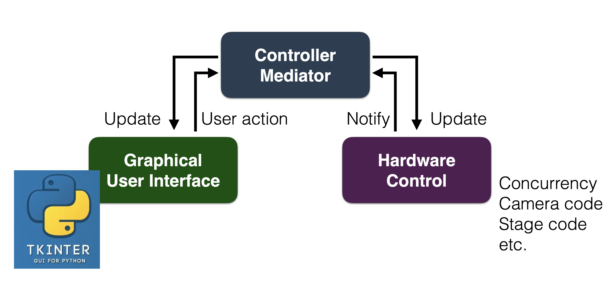
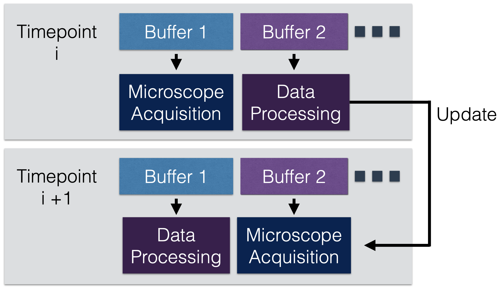
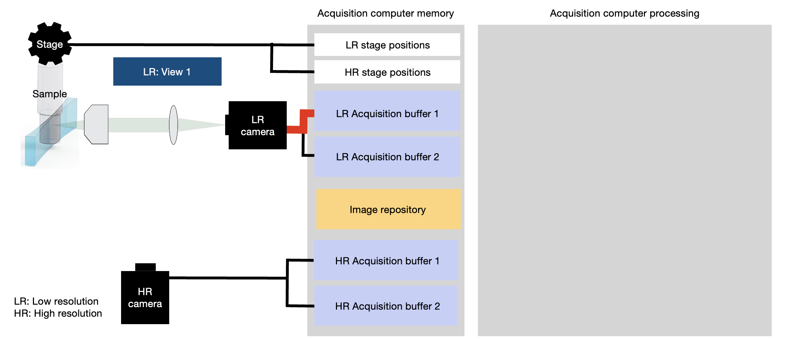
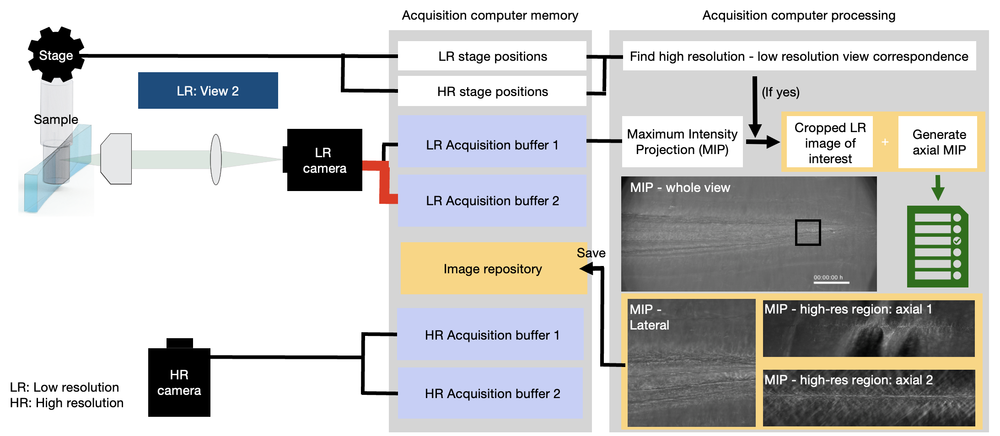
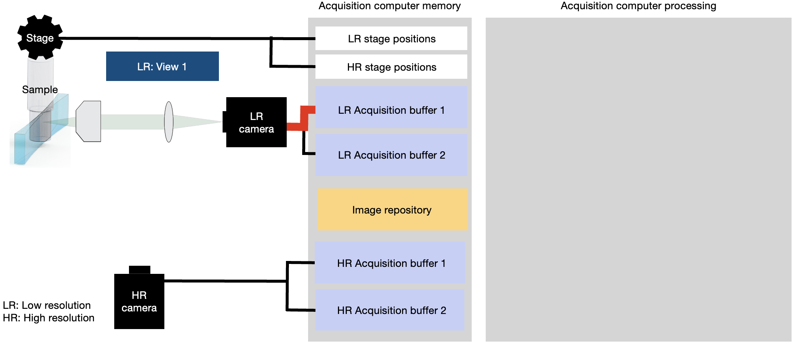
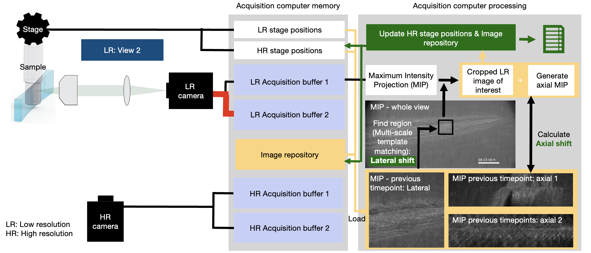

=================
Code organization
=================

General overview
================

The software follows an MVC design pattern with:

:the controller: multiScale_main.py
:the model: multiScope.py with all hardware control code in src
            (camera, filter wheel, slit, stages, ni_board)
:the viewer: gui folder and image viewer (auxiliary_code.napari_in_subprocess.py)

The hardware are synchronized in time using an NI DAQ card (ni_board).
The voltage arrays for the NI board are generated in the acquisition_array_class.py file.

Concurrent image acquisition and analysis with buffer queue
===========================================================

To optimize imaging time, the microscope relies on a buffer queue and an array of shared memory buffers

.. code-block:: python

     self.low_res_buffers = [
                    ct.SharedNDArray(
                        shape=(self.stack_nbplanes_lowres, self.current_lowresROI_height, self.current_lowresROI_width),
                        dtype='uint16')
                    for i in range(self.lowresbuffernumber)]

This allows to acquire data to one buffer and perform computation / image analysis on another buffer. At
a next time point the roles of the buffers are reversed. The data in the buffer to which data was acquired
to is now ready to be processed and analyzed

As a result, overall imaging time is improved as the microscope does not need
to wait for data to be analyzed/processed before acquiring the next volume.
Currently, the microscope generates maximum intensity projections and (optionally) self-driving
microscope control to keep high-resolution regions in focus over hours of imaging.

All these image processing and analysis tasks are performed from
a results thread that calls the function "calculate_projection_and_drift".
In future, this also the place to integrate event-based detections.

.. code-block:: python

            projection_thread = ct.ResultThread(target=calculate_projection_and_drift).start()

Self-driving features
=====================

To enable self-driving microscopy, the microscope relies on concurrent imaging and analysis (see above).

First timepoint
---------------

In a typical routine, the microscope starts acquiring a stack to a buffer (LR acquisition buffer 1):

After acquisition of this first region, the acquisition of the second region (volume) starts to a second
buffer (LR acquisition buffer 2).

As the microscope acquires data, LR acquisition buffer 1 is processed. If this is the first timepoint,
correspondence between low-and high-resolution regions for the self-driving
modules are not yet established. Therefore, the microscope checks if this is the channel (signal) on
which correspondence should be established and if there is a high-resolution region within this low-resolution
volume. If yes, populate the image library for this high-resolution regions with the data of the current
channel (signal). The data saved are the maximum intensity projections in X-Y, Y-Z, X-Z views.

After the low-resolution regions have been acquired, high-resolution data is acquired and saved to disk.

Later timepoint
---------------

At a later timepoint, similarly to the first timepoint, the microscope starts
acquiring a stack to a buffer (LR acquisition buffer 1):

After acquisition of this first region, the acquisition of the second region (volume) starts to a second
buffer (LR acquisition buffer 2).

In contrast to the first timepoint, image correspondence is already established.  If this is the
channel (signal) which is used for self-driving microscope correction, and if there is a
high-resolution region within this low-resolution, its maximum intensity projections
in X-Y, X-Z, Y-Z views of the previous timepoint are loaded into
memory from the image repository. Then, using multi-scale template matching, the current
position of the region of interest is found in the newly acquired data using the maximum intensity
projection view in X-Y direction. The X-Z and Y-Z projections are then formed of the cropped low-resolution
data around the newly found region and the axial shift is calculated. Lastly, the image repository is
updated with the new maximum intensity projections.

.

