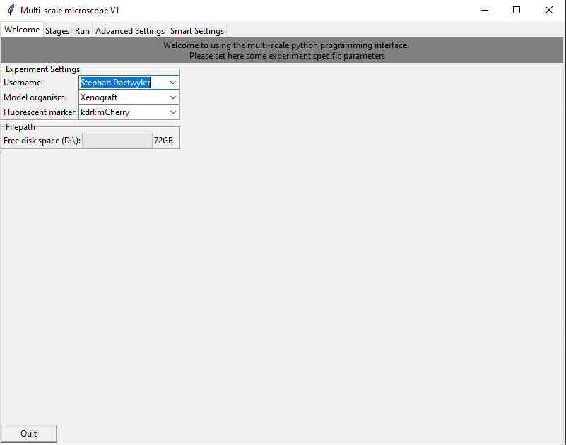
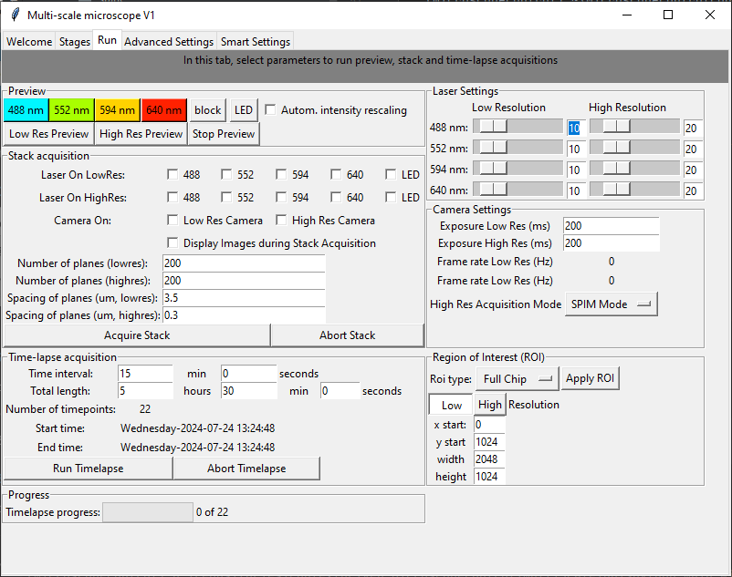
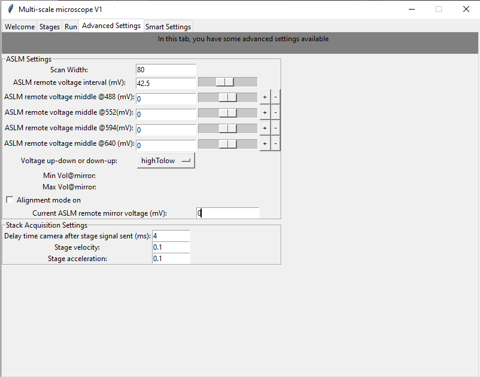

====================
User interface (GUI)
====================

Our user interface is organized into different notebooks corresponding to
different tasks: a Welcome tab, a Stage settings tab,
a Run tab, a tab for advanced settings and a tab for setting self-driving microscopy features.

As the microscope is designed with an underlying MVC design pattern, the GUI for user input
can be started independent of the microscope:

.. code-block:: console

   (microscopecontrol) ~\MicroscopeControl\multiScale> cd gui
   (microscopecontrol) ~\MicroscopeControl\multiScale\gui> python main_window.py

Welcome tab
===========

Please set here the user name, model organism and fluorophores. The user name and model organism
define the filepath under which the data is saved. Here, for example the data would be saved
in the folder date\_username_modelorganism. Moreover, the tab shows how much space is still on the
harddrive.

Stage tab
=========

In the stage tab, the acquisition positions are set and defined (Low Resolution Positions
and High Resolution Positions table). To move the stage, new stage positions can be entered
directly, the stage could be moved with the arrow buttons or movement with the keyboard
can be activated. Moreover, a mosaic of stage positions can be generated from initially set
positions. The step size for moving the stage manually is determined in the panel
"Stage Movement Settings".

Run tab
=======

In the run tab, the user can start running a low-resolution or high-resolution
preview and select the corresponding laser line for preview. To automatically rescale the intensity
in the preview, tick the "Autom. intensity rescaling" box.

To start a stack acquisition, select the laser and cameras, number of planes and their spacing
in the "Stack acquisition" panel. Pressing the "Acquire Stack" button starts a single stack acquisition.

To repeatedly run a stack acquisition, set the time interval and total length of time-lapse imaging, and
start a time-lapse acquisition with "Run Timelapse". Time-lapse progress is indicated in the "Progress panel".

To modify acquisition settings, change the laser power of low-resolution and high-resolution acquisition,
camera settings and acquisiton mode for the high-resolution camera (SPIM or ASLM), and the ROI used
on the camera.

Advanced Settings tab
=====================

In the advanced settings tab, settings for the ASLM acquisition are set. Moreover, an alignment mode is
available for the high-resolution SPIM acquisition to move the voltage of the remote voice coil.

